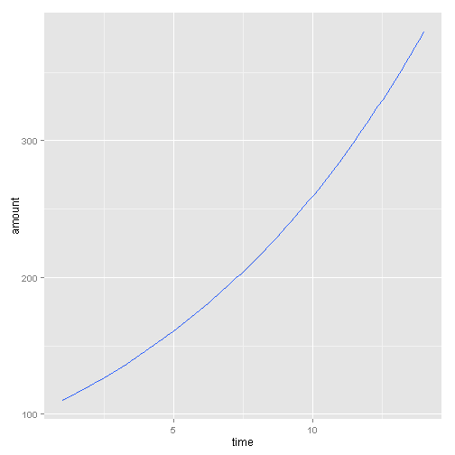

Presentation1 : To understand the computation of Compound Interest
========================================================
author: Piyush Jaiswal
date: 21st January 2015


Introduction 
========================================================

- The following presentation will pitch the idea of how one can estimate the returns one can expect after investing in a venture or bank 
- The parameters of concern are the rate of interest, taken yearly, also referred to as per annum
- The second parameter of concern is the time, measured in the number of years

Formula
========================================================

- The formula for estimating the returns after 't' years, for a principal 'P', for a rate of interest 'r' per annum would be - $P*(1+r/100)^t$
- The slide next shows how the amount varies with increase in the number of years, for a fixed rate of interest = 10% and for a fixed principal amount of Rs 100


Slide with Code
========================================================


```r
time<-seq(from=1,to=14,by=1)
amount<-100*((1+0.1)^time)
time<-data.frame(time)
amount<-data.frame(amount)
data_final<-cbind(time,amount)
data_final
```

```
   time amount
1     1  110.0
2     2  121.0
3     3  133.1
4     4  146.4
5     5  161.1
6     6  177.2
7     7  194.9
8     8  214.4
9     9  235.8
10   10  259.4
11   11  285.3
12   12  313.8
13   13  345.2
14   14  379.7
```

Slide With Plot
========================================================

 
